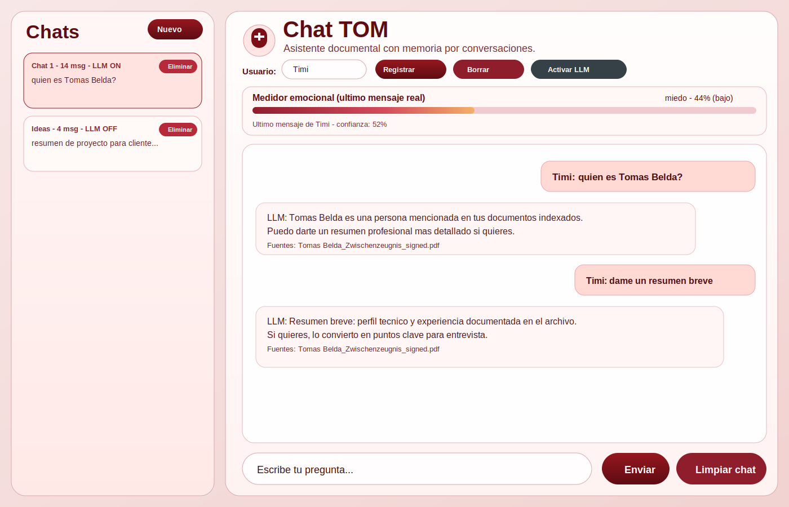

# TomRag (Chat TOM)

TomRag is a local RAG chat assistant with:
- a Flask web UI,
- a SQLite chat memory database with multiple conversations,
- a local vector database (Chroma),
- a local Llama GGUF model for generation,
- optional internet fallback when local RAG context is missing.

## Chat Screenshot



## What This Project Is For

This project helps you ask questions about your own documents (`.txt` and `.pdf`) and keep a persistent conversation history.  
It is useful when you want a private/local assistant that:
- answers based on your indexed files,
- keeps separate chat threads,
- can optionally use web snippets if local context is not enough.

## How It Works

1. You index documents from `documentos/` with `src/indexar.py`.
2. The script splits text into chunks and stores embeddings in `vectordb/` (Chroma).
3. In chat, the app retrieves relevant chunks (RAG).
4. The Llama model generates an answer using that context.
5. If no useful RAG context is found, internet fallback can fetch web context.
6. Messages are saved to `data/chat_history.db` by conversation.

## Project Structure

- `run_flask.py`: app entrypoint (initializes DB + model, starts Flask).
- `src/app_flask.py`: HTTP routes (`/api/chat`, `/api/history`, `/api/conversations`).
- `src/chat_rag.py`: retrieval + generation + optional web fallback.
- `src/chat_history_db.py`: SQLite schema and chat persistence.
- `src/indexar.py`: document indexing pipeline.
- `templates/chat.html`: main UI template.
- `static/chat.css`: frontend style.
- `static/chat.js`: frontend chat logic.
- `documentos/`: source files to index.
- `vectordb/`: Chroma persistent vector store.
- `data/chat_history.db`: SQLite chat history and conversations.
- `modelos/`: local GGUF model files.

## Requirements

Install dependencies:

```bash
pip install -r requirements.txt
```

Main Python packages used:
- Flask
- chromadb
- sentence-transformers
- llama-cpp-python
- pypdf
- PyMuPDF
- pdf2image
- pytesseract

## LLM Model (Default)

Expected default model:
- `Meta-Llama-3.1-8B-Instruct-Q4_K_M.gguf`
- expected path: `modelos/Meta-Llama-3.1-8B-Instruct-Q4_K_M.gguf`
- source: [bartowski/Meta-Llama-3.1-8B-Instruct-GGUF](https://huggingface.co/bartowski/Meta-Llama-3.1-8B-Instruct-GGUF)

Quick download (if you have `huggingface-cli`):

```bash
huggingface-cli download \
  bartowski/Meta-Llama-3.1-8B-Instruct-GGUF \
  Meta-Llama-3.1-8B-Instruct-Q4_K_M.gguf \
  --local-dir modelos
```

Use a custom model path:

```bash
export LLAMA_MODEL_PATH="/path/to/your/model.gguf"
```

## Index Your Documents

Put `.txt` or `.pdf` files in `documentos/`, then run:

```bash
python3 src/indexar.py
```

Notes:
- PDFs are extracted with multiple methods (`pypdf`, `pymupdf`, `pdftotext`, OCR fallback).
- Re-indexing updates previous chunks for the same file IDs.

## Run the App

```bash
python3 run_flask.py
```

By default, Flask runs on:
- `http://0.0.0.0:8080`

## API Summary

- `POST /api/chat`: ask a question and get answer + sources.
- `GET /api/history?conversation_id=<id>`: get messages for one chat.
- `DELETE /api/history?conversation_id=<id>`: clear messages in one chat.
- `GET /api/conversations`: list conversations.
- `POST /api/conversations`: create a conversation.
- `DELETE /api/conversations/<id>`: delete one conversation (including messages).

## Internet Fallback (When RAG Has No Context)

If local context is missing, the app can query web context as fallback.

Optional environment variables:

```bash
export ENABLE_WEB_FALLBACK=1
export WEB_MAX_RESULTADOS=3
export WEB_TIMEOUT_S=8
```

## Conversation Memory

The app stores:
- chat threads (`chat_conversations` table),
- chat messages (`chat_messages` table),
- per-message role/content/timestamp/sources.

This allows:
- multiple independent chat conversations,
- switching chats from the sidebar,
- deleting specific conversations from both UI and database.
